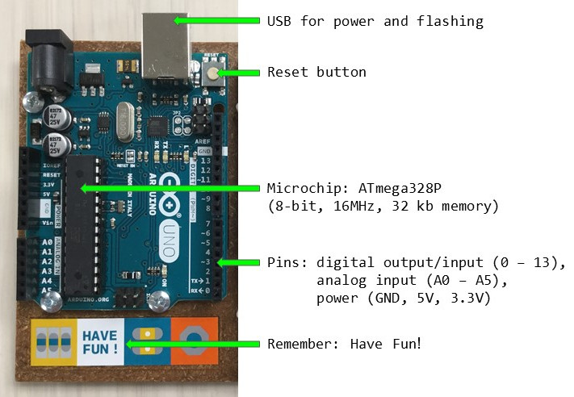

# Introducing Arduino 

> Learn about the [Arduino](https://www.arduino.cc/) electronics platform by making lights blink and buzzers buzz! Using simple, open-source, and interactive hardware and software components, Arduino makes learning code and creating physical computing projects easy. During this workshop we will build basic electronic circuits and program an Arduino micro controller. This is an introduction for beginners from all backgrounds, no experience with electronics or coding required!

## Preparation 

For this workshop you will need:

- Arduino UNO and usb cable. *[provided by the MILL]*
- a few basic electronic components, as found in most Arduino starter kits: a breadboard, some jumper wires, a piezo, a 10k ohm resistor, a few 330 ohm resistors, a photoresistor, and a few LEDs. *[provided by the MILL]*
- [Arduino Software IDE](https://www.arduino.cc/en/Main/Software) installed on your computer *OR* set up an online IDE such as [Codebender](https://codebender.cc/) or [Arduino Web Editor](https://create.arduino.cc/editor) [note: if you use Chrome OS it will be necessary to use an online editor]. Arduino IDE is a [free](https://www.gnu.org/philosophy/free-sw.en.html) and open-source software. *[the MILL will have some laptops available for use, however it will be helpful to set up Arduino on your own computer so that it will be available for you in the future.]*

In addition, you should download a copy of the *sketches* (i.e. code) for the workshop projects from the GitHub [repository](https://github.com/evanwill/introArduino):

1. download the ZIP package from the repository, <https://github.com/evanwill/introArduino/archive/master.zip>
2. unzip the file (`introArduino-master.zip`)
3. move the contents of the unzipped folder to your `Arduino` directory (usually found in your `Documents`).

> *More info:* The Arduino IDE is based on the "sketchbook" created for [Processing](https://processing.org/) and [Wiring](http://wiring.org.co/), platforms originally designed for creating interactive projects in the visual arts. The Arduino programming language is really a set of libraries in [C](https://en.wikipedia.org/wiki/C_(programming_language)) and [C++](https://en.wikipedia.org/wiki/C%2B%2B). Arduino IDE hides some of the complexity of setting up, but be proud that you are writing C/C++ code!

## Introducing Arduino UNO

Meet your *microcontroller*!

Arduino is an easy to use prototyping board based on **open-source** hardware and software.

Simple programming language,
https://www.arduino.cc/en/Reference/HomePage 

https://create.arduino.cc/projecthub

